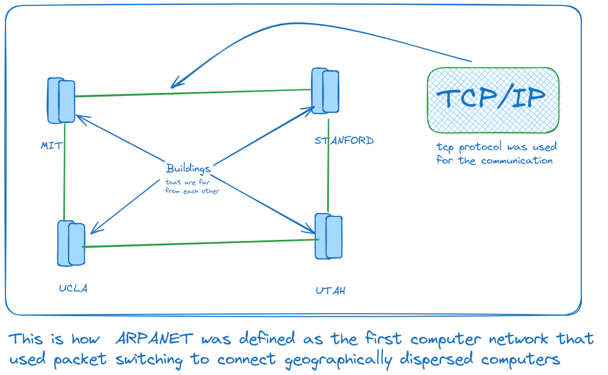
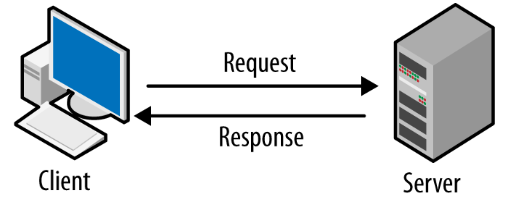
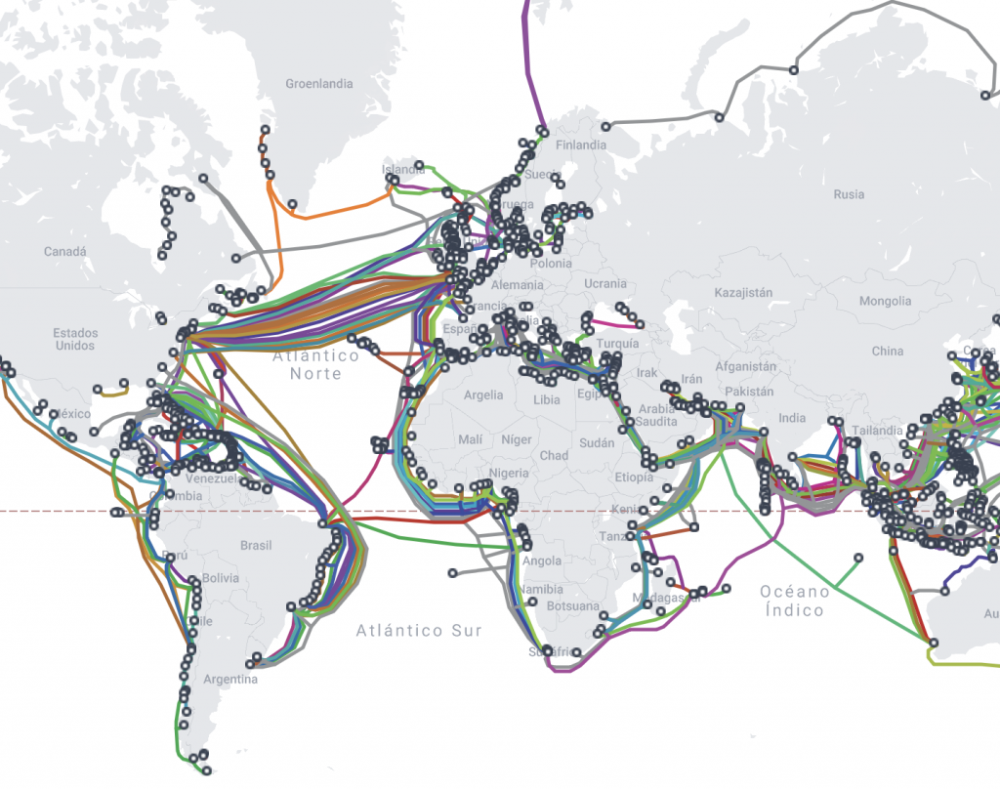

# Computer Networking

## How it all started?

- The Cold was going on the United States and the soviet union were battling one another like who was going to be the first.
- And when it came to launching the world's first satellite Russia (the soviet union) won, they launched ***Sputnik*** 1 the first artificial Earth satellite. It was launched into an elliptical low Earth orbit by the Soviet Union on 4 October 1957.
- So in this competition, the U.S was not silent but they launched their first program named ARPA(Advance Research Project Agency) and it worked to do all the scientific discoveries and keep their country no.1
- ARPANET: **ARPANET was the first operational computer network that became the foundation of the modern internet**. ARPANET is defined as the first computer network that used packet switching to connect geographically dispersed computers and laid the foundation for developing the Internet.

The U.S. Advanced Research Projects Agency Network (ARPANET) was the first public [packet](https://www.techtarget.com/searchnetworking/definition/packet)-switched [computer network](https://www.techtarget.com/searchnetworking/definition/network). It was first used in 1969 and finally decommissioned in 1989. ARPANET's main use was for academic and research purposes.

## WWW came into the picture:

So we wanted to send the research paper and this research paper has the link in it to the other research paper but we weren’t able to do that because this automated sharing was missing.

Then www came into the picture and it was developed by Mr. Tim Berners Lee, so www is the project that stores these documents and we can access these via www. It did not have a search engine so you were not able to search anything on this website.

this is the world's first website:[http://info.cern.ch](http://info.cern.ch/)./

- The World Wide Web, commonly known as the Web. is an information system where documents and other web resources are identified by uniform resource locations (URLs, such as https:/example.com/), which may be interlinked by hyperlinks and are accessible over the internet.

## The Internet Society is responsible for all the rules and regulations that we have to send our data over the Internet.

## Client-Server Architecture:

- various countries and continents across the world we are connected via wires these wires are laid under the oceans.

”So the internet is not like in the clouds but it’s under the sea”
- Submarine cables map (Optical Fibre Cable)

Submarine Cables Map(optical fiber cables)

- Your computer/laptop can work as a client and server.
- this is the typical client-server model: