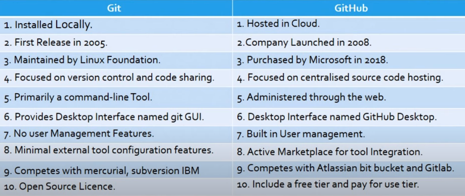

## Git

Git is a version control system used to keep track of changes made in your code.

But why it is called VCS:

- Because the main feature of git is to manage different versions.

### Let’s understand by an example:

- Let's say you have to make an application and for that application, you have to write the code, and you wrote the code for your application which is the first version, and now you have made the changes and you have the second version, after you make changes there is the third version of your application and so on.
- Git is used to manage all the different versions you have for your application and not only this you can also revert to any previous version if you have any issue with the current version.
- Git also provides you with a branching and merging system, and using branches you can work on new features and bug fixes independently without affecting the main code base once you are done you can merge that branch into the main code base to make sure that your application is working properly with the new version of your code
- Along with this git allows multiple developers to collaborate on a single code base which can help for more collaboration and teamwork.

> ”So using git we can track, manage, and collaborate on source code very effectively”
> 

## GitHub:

It is an online website where developers push their code.

---

# Git and GitHub Blog

| Image | Blog Link |
|-------|-----------|
|  | [Git and GitHub blog](https://surajk00.hashnode.dev/getting-to-know-git-and-github-your-codes-best-friends) |

