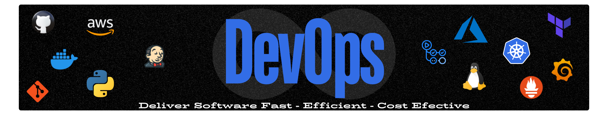
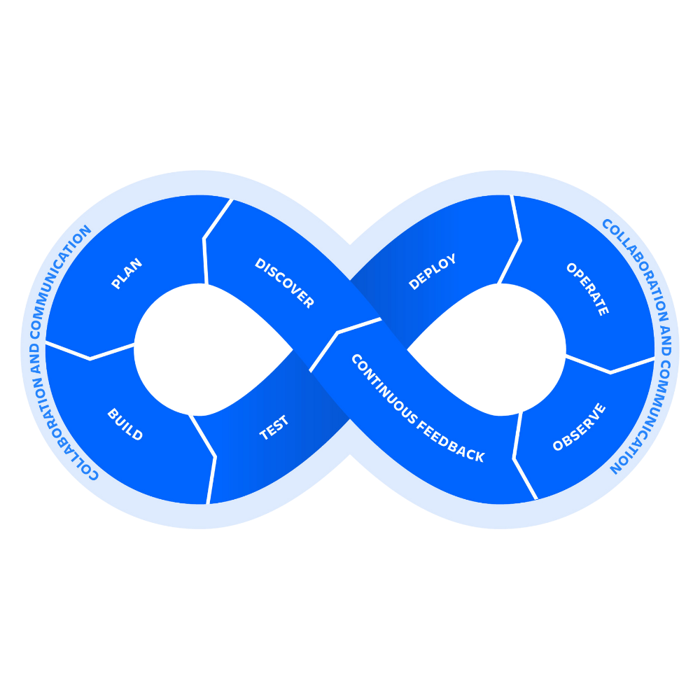
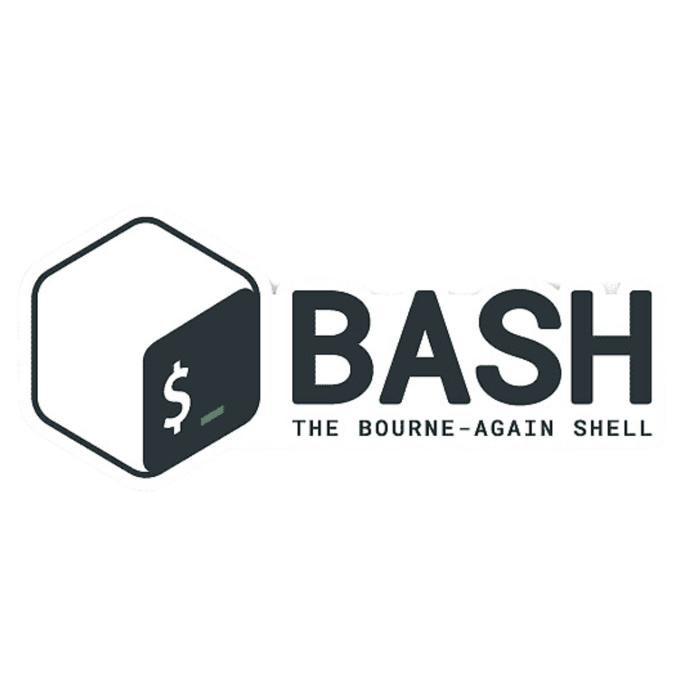
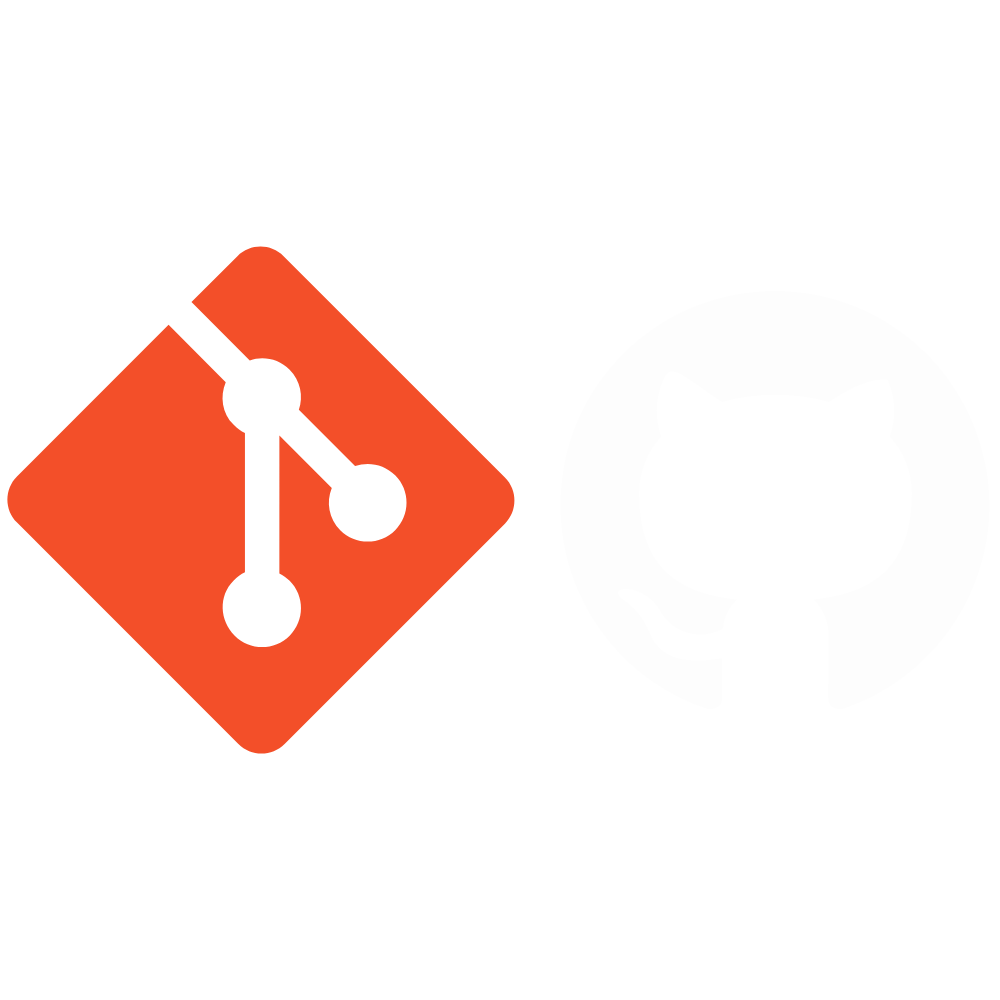
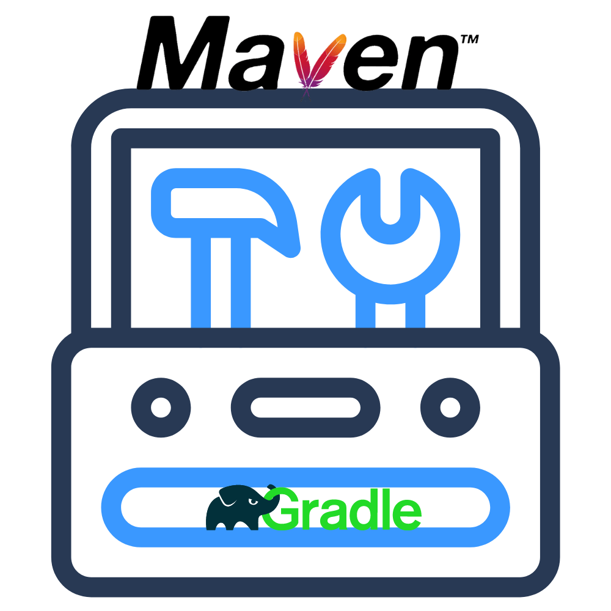
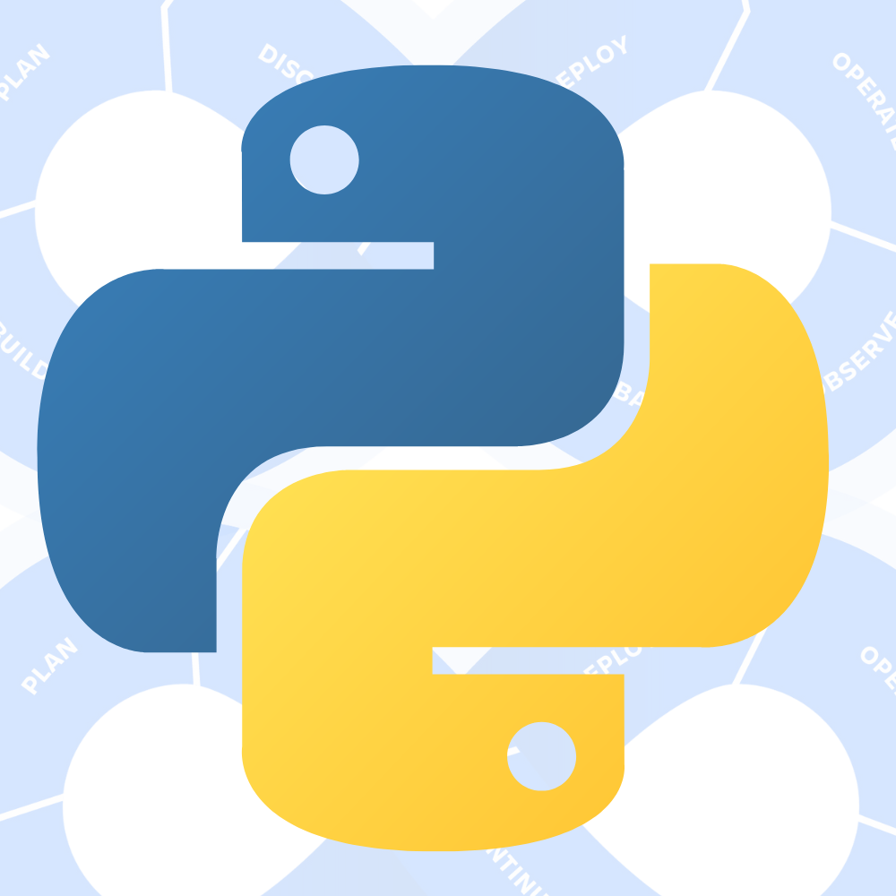
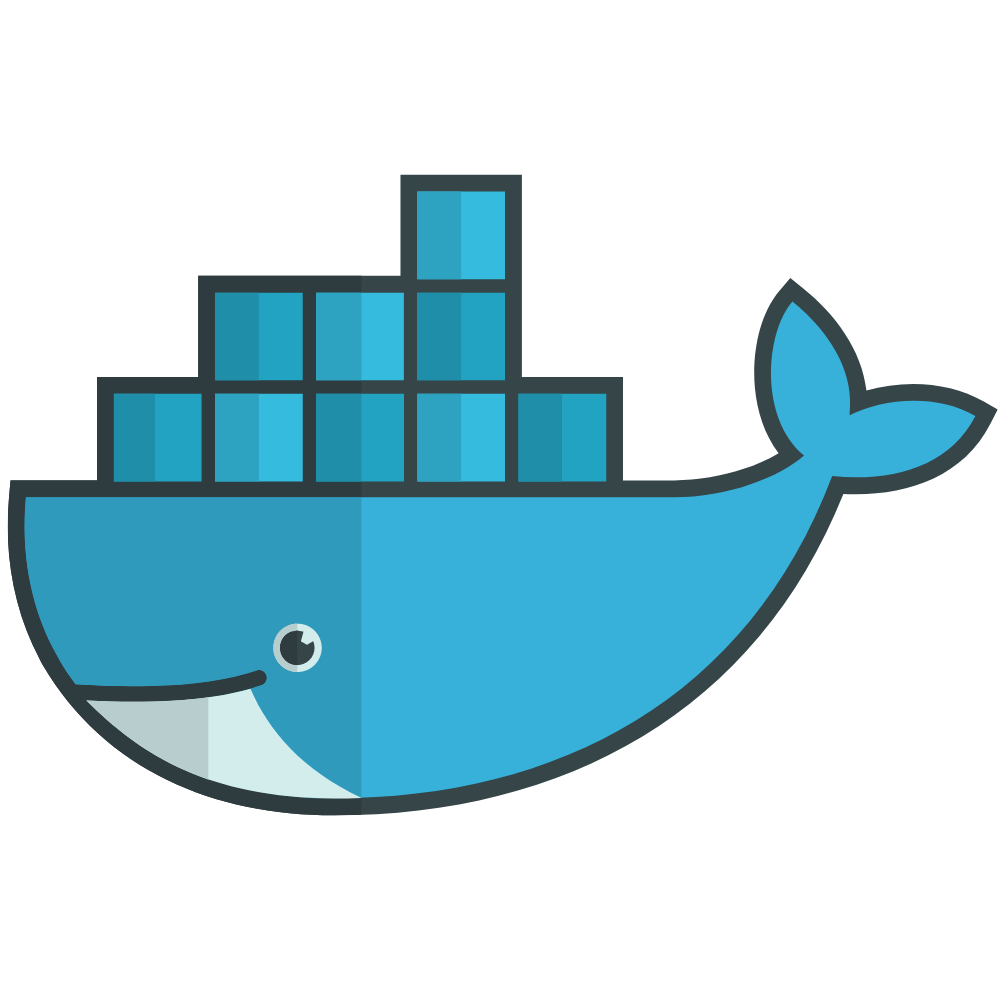
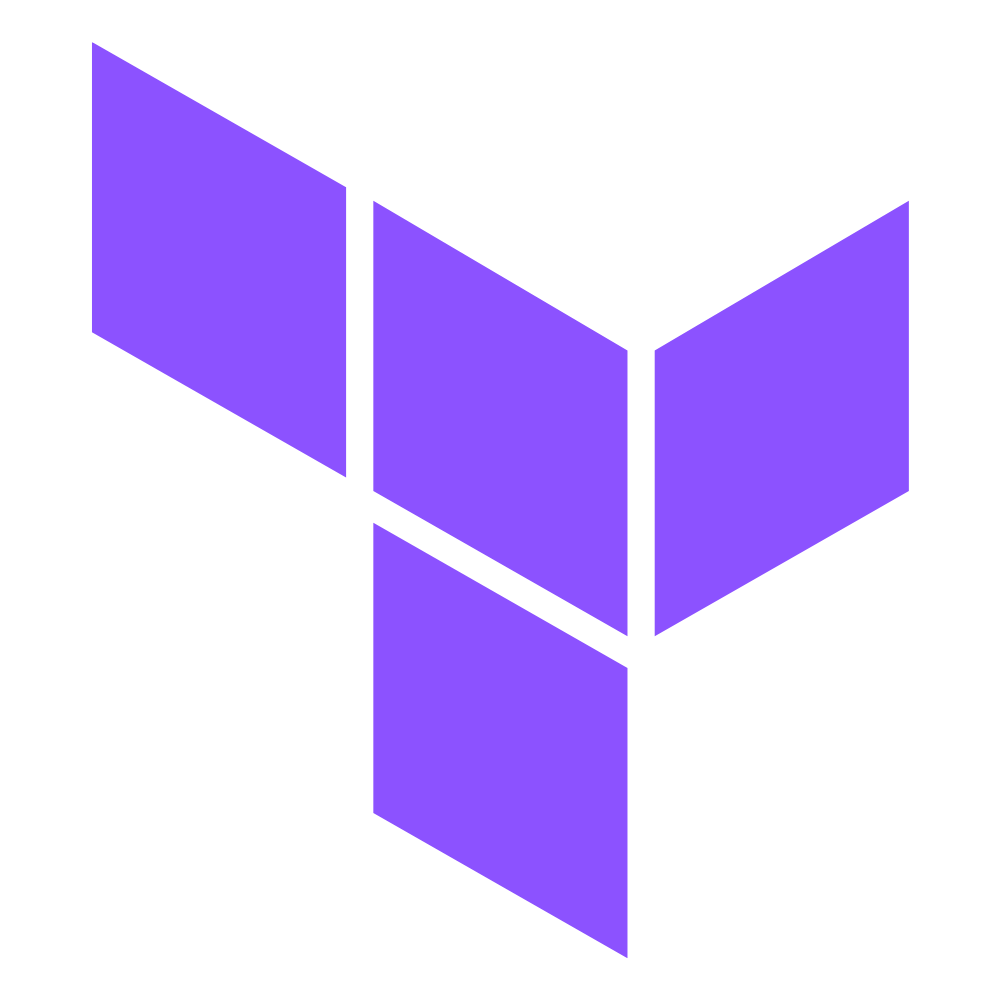

<h3 align= "center"> Documenting my all learning and resources of DevOps </h3>

---

## Complete Blog Documentation:

### [DevOps Blog Series](https://surajk00.hashnode.dev/series/devops-practices)

---

## DevOps Roadmap 2025

---

## Understanding DevOps

- [Notion Notes](https://surajkumar00.notion.site/Understanding-DevOps-f1f9aad413324e6cb1c78e2caeae5795?pvs=4)
- [Video Courses](https://github.com/Suraj-kumar00/DevOps/tree/main/Understanding_DevOps/Video_Resources)
- [Blog resource](https://github.com/Suraj-kumar00/DevOps/tree/main/Understanding_DevOps/Blog_Resources)

 

## Learning Linux

- [Notion Notes](https://surajkumar00.notion.site/Learning-Linux-52fe48ab9ede4f709e059886c30a70a3?pvs=4)
- [Video Courses](https://github.com/Suraj-kumar00/DevOps/tree/main/Linux/Video_Resources)
- [Blog resource](https://github.com/Suraj-kumar00/DevOps/tree/main/Linux/Blog_Resources)
- [Linux Cheatsheet](https://cheatography.com/davechild/cheat-sheets/linux-command-line/)

 

## Computer Networking

- [Notion Notes](https://surajkumar00.notion.site/Computer-Networking-7ebc4910536249329bbc21563899d621?pvs=4)
- [Video Courses](https://github.com/Suraj-kumar00/DevOps/tree/main/Computer_Networking/Video_Resources)
- [Blog resource](https://github.com/Suraj-kumar00/DevOps/tree/main/Computer_Networking/Blog_Resources)

 

## Shell/ Bash Scripting

- [Notion Notes](https://surajkumar00.notion.site/Shell-Bash-Scripting-a250e00baeaa4506b43e4429f18c065c?pvs=4)
- [Video Courses](https://github.com/Suraj-kumar00/DevOps/tree/main/Bash_Scripting/Video_Resources)
- [Blog resource](https://github.com/Suraj-kumar00/DevOps/tree/main/Bash_Scripting/Blog_Resources)

 

## Git and GitHub

- [Notion Notes](https://surajkumar00.notion.site/Git-and-GitHub-b08edfadba2a4c33860949dfb8d81ae7?pvs=4)
- [Video Courses](https://github.com/Suraj-kumar00/DevOps/tree/main/Git_and_Github/Video_Resources)
- [Blog resource](https://github.com/Suraj-kumar00/DevOps/tree/main/Git_and_Github/Blog_Resources)

 

## Build and package manager tools

- [Notion Notes](https://surajkumar00.notion.site/Build-and-package-manager-tools-b911aebca40642cca041780a82c4201a?pvs=4)
- [Video Courses](https://github.com/Suraj-kumar00/DevOps/tree/main/Build_tools/Video_Resources)
- [Blog resource](https://github.com/Suraj-kumar00/DevOps/tree/main/Build_tools/Blog_Resources)

 

## YAML

- [Notion Notes](https://surajkumar00.notion.site/YAML-YAML-Ain-t-Markup-Language-356715dae3fa432a8af713cf38e9fbdd?pvs=4)
- [Video Courses](https://github.com/Suraj-kumar00/DevOps/tree/main/YAML/Video_Resources)
- [Blog resource](https://github.com/Suraj-kumar00/DevOps/tree/main/YAML/Blog_Resources)

 

## Python for DevOps

- [Notion Notes](https://surajkumar00.notion.site/Python-for-DevOps-7c6d6cb5f5b54c7098deddc1c4ffc69e?pvs=4)
- [Video Courses](https://github.com/Suraj-kumar00/DevOps/tree/main/Python_for_DevOps/Video_Resources)
- [Blog resource](https://github.com/Suraj-kumar00/DevOps/tree/main/Python_for_DevOps/Blog_Resources)

 

## Cloud platforms

#### For AWS(Amazon Web Services)

- [Notion Notes](https://surajkumar00.notion.site/Learning-AWS-7399a5eaa9674b44932ee52374110629?pvs=4)
- [Video Courses](https://github.com/Suraj-kumar00/DevOps/tree/main/Cloud_platforms/AWS/Video_Resources)
- [Blog resource](https://github.com/Suraj-kumar00/DevOps/tree/main/Cloud_platforms/AWS/Blog_Resources)

#### For Microsoft Azure

- [Notion Notes](https://surajkumar00.notion.site/Learning-Microsoft-Azure-a5abd9814d134f1f9f6f1a4dba09b501?pvs=4)
- [Video Courses](https://github.com/Suraj-kumar00/DevOps/tree/main/Cloud_platforms/Microsoft_Azure/Video_Resources)
- [Blog resource](https://github.com/Suraj-kumar00/DevOps/tree/main/Cloud_platforms/Microsoft_Azure/Blog_Resources)

 

## Docker

- [Notion Notes](https://surajkumar00.notion.site/Containerization-Docker-0d09fa2b92dd46ac9e938e573bb10e64?pvs=4)
- [Video Courses](https://github.com/Suraj-kumar00/DevOps/tree/main/Docker/Video_Resources)
- [Blog resource](https://github.com/Suraj-kumar00/DevOps/tree/main/Docker/Blog_Resources)

 

## Kubernetes

- [Notion Notes](https://surajkumar00.notion.site/Container-Orchatration-Kubernetes-c43869b2dda84e1c8c6218de5b5bdc43?pvs=4)
- [Video Courses](https://github.com/Suraj-kumar00/DevOps/tree/main/Kubernetes/Video_Resources)
- [Blog resource](https://github.com/Suraj-kumar00/DevOps/tree/main/Kubernetes/Blog_Resources)
   

## CI/CD

- [Notion Notes](https://surajkumar00.notion.site/CI-CD-e999decefb8243a2b613a304bf1fe38b?pvs=4)
- [Video Courses](https://github.com/Suraj-kumar00/DevOps/tree/main/CICD/Video_Resources)
- [Blog resource](https://github.com/Suraj-kumar00/DevOps/tree/main/CICD/Blog_Resources)

 

## Infrastructure as code

#### Terraform

- [Notion Notes](https://surajkumar00.notion.site/Infrastructure-as-code-81a1e5e6f9e442e4bf8799151dec35c2?pvs=4)
- [Video Courses](https://github.com/Suraj-kumar00/DevOps/tree/main/Infrastructure_as_code/Video_Resources)
- [Blog resource](https://github.com/Suraj-kumar00/DevOps/tree/main/Infrastructure_as_code/Blog_Resources)

 

## DevOps Projects

1. [DevOps URL to QR code Generator](https://github.com/Suraj-kumar00/DevOps-URL2QR)
