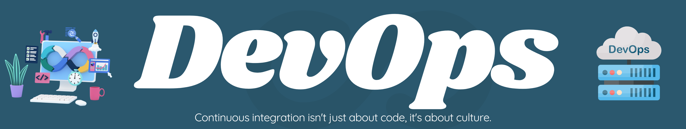

<h3 align= "center"> Documenting my all learning and resources of DevOps </h3>

---

# Complete Blog Documentation:

## [DevOps Blog](https://surajk00.hashnode.dev/series/devops-practices)

---

## Understanding DevOps

- [Notion Notes]()
- [Video Courses](https://github.com/Suraj-kumar00/DevOps/tree/main/Understanding_DevOps/Video_Resources)
- [Blog resource](https://github.com/Suraj-kumar00/DevOps/tree/main/Understanding_DevOps/Blog_Resources)

 

## Learning Linux

- [Notion Notes]()
- [Video Courses](https://github.com/Suraj-kumar00/DevOps/tree/main/Linux/Video_Resources)
- [Blog resource](https://github.com/Suraj-kumar00/DevOps/tree/main/Linux/Blog_Resources)
- [Linux Cheatsheet](https://cheatography.com/davechild/cheat-sheets/linux-command-line/)

 

## Computer Networking

- [Notion Notes]()
- [Video Courses](https://github.com/Suraj-kumar00/DevOps/tree/main/Computer_Networking/Video_Resources)
- [Blog resource](https://github.com/Suraj-kumar00/DevOps/tree/main/Computer_Networking/Blog_Resources)

 

## Shell/ Bash Scripting

- [Notion Notes]()
- [Video Courses](https://github.com/Suraj-kumar00/DevOps/tree/main/Bash_Scripting/Video_Resources)
- [Blog resource](https://github.com/Suraj-kumar00/DevOps/tree/main/Bash_Scripting/Blog_Resources)

 

## Git and GitHub

- [Notion Notes]()
- [Video Courses](https://github.com/Suraj-kumar00/DevOps/tree/main/Git_and_Github/Video_Resources)
- [Blog resource](https://github.com/Suraj-kumar00/DevOps/tree/main/Git_and_Github/Blog_Resources)

 

## Build and package manager tools

- [Notion Notes]()
- [Video Courses](https://github.com/Suraj-kumar00/DevOps/tree/main/Build_tools/Video_Resources)
- [Blog resource](https://github.com/Suraj-kumar00/DevOps/tree/main/Build_tools/Blog_Resources)

 

## YAML

- [Notion Notes](https://www.notion.so/surajkumar00/YAML-356715dae3fa432a8af713cf38e9fbdd)
- [Video Courses](https://github.com/Suraj-kumar00/DevOps/tree/main/YAML/Video_Resources)
- [Blog resource](https://github.com/Suraj-kumar00/DevOps/tree/main/YAML/Blog_Resources)

 

## Python for DevOps

- [Notion Notes]()
- [Video Courses](https://github.com/Suraj-kumar00/DevOps/tree/main/Python_for_DevOps/Video_Resources)
- [Blog resource](https://github.com/Suraj-kumar00/DevOps/tree/main/Python_for_DevOps/Blog_Resources)

 

## Cloud platforms

#### For AWS(Amazon Web Services)
- [Notion Notes]()
- [Video Courses](https://github.com/Suraj-kumar00/DevOps/tree/main/Cloud_platforms/AWS/Video_Resources)
- [Blog resource](https://github.com/Suraj-kumar00/DevOps/tree/main/Cloud_platforms/AWS/Blog_Resources)

#### For Microsoft Azure
- [Notion Notes]()
- [Video Courses](https://github.com/Suraj-kumar00/DevOps/tree/main/Cloud_platforms/Microsoft_Azure/Video_Resources)
- [Blog resource](https://github.com/Suraj-kumar00/DevOps/tree/main/Cloud_platforms/Microsoft_Azure/Blog_Resources)

 

## Containerization/Docker

- [Notion Notes]()
- [Video Courses]()
- [Blog resource]()

 

## Kubernetes

- [Notion Notes]()
- [Video Courses]()
- [Blog resource]()
   

## CI/CD

- [Notion Notes]()
- [Video Courses]()
- [Blog resource]()

 

## Infrastructure as code

- [Notion Notes]()
- [Video Courses]()
- [Blog resource]()

 

## DevOps Projects

- To be listed...
