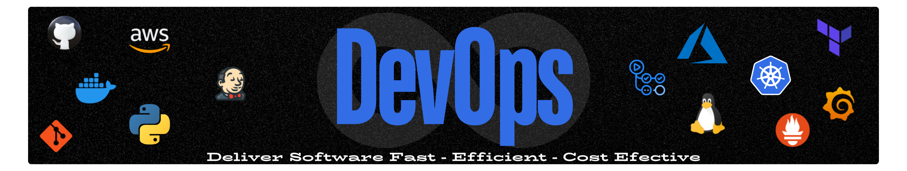

# DevOps Learning Hub

A free, open-source handbook for **DevOps, DevSecOps, MLOps, LLMOps and AI infrastructure on Kubernetes**.
Every topic page starts from the official documentation, adds a hands-on example that was actually run,
and ends with production notes and interview scenarios for every experience level.

[Start here](content/docs/%28start%29/index.mdx) ·
[How pages are built](content/docs/%28start%29/page-template.mdx) ·
[Contributing](CONTRIBUTING.md)

## Tracks

| Track                            | Focus                                                                                                       |
| -------------------------------- | ----------------------------------------------------------------------------------------------------------- |
| **AI Infrastructure** (flagship) | GPUs on Kubernetes, GPU sharing and scheduling, model and LLM serving, autoscaling, GPU observability, cost |
| **LLMOps**                       | Serving patterns, evaluation, LLM observability, RAG infrastructure, AI gateways, guardrails                |
| **MLOps**                        | ML lifecycle, experiment tracking, pipelines, CI/CD for ML, model monitoring                                |
| **DevOps**                       | Containers, Kubernetes, Helm, Terraform, CI/CD, GitOps, observability, SRE, platform engineering            |
| **DevSecOps**                    | Supply chain security, image scanning, secrets, Kubernetes hardening, policy as code, runtime security      |
| **Foundations**                  | Linux, networking, Git, shell scripting, YAML, Python and Go                                                |

Each track page lists what is published and what is on the roadmap. The roadmap is data in the
track's frontmatter, so it updates itself as pages are written.

## How every page is built

1. **What and why**: a plain-language definition from the official docs.
2. **How it works**: architecture and concepts, with a diagram drawn for the site.
3. **Hands-on**: a minimal example, pinned to the version it was tested with.
4. **Production notes**: failure modes, trade-offs, security, observability and cost.
5. **Interview scenarios**: scenario-based questions tagged by level.
6. **Sources and credits**: official docs first, and every community author named.

The frontmatter contract (level, tested version, verification date, sources) is enforced at
build time, and pages not verified for 180 days show an "outdated" warning.

## For AI tools

- `/llms.txt` and `/llms-full.txt`: an index of every page, and the full text.
- Any docs URL with `.md` appended returns Markdown. Requests with `Accept: text/markdown` get
  Markdown too.
- `/api/mcp`: a read-only [MCP](https://modelcontextprotocol.io) server with `list_pages`,
  `get_page` and `search` tools.

```json
{
  "mcpServers": {
    "devops-hub": { "url": "https://<your-deployment>/api/mcp" }
  }
}
```

## Tech stack

[Fumadocs](https://fumadocs.dev) 16 on [Next.js](https://nextjs.org) 16 and React 19,
Tailwind CSS 4, TypeScript 7, [oxlint](https://oxc.rs), Prettier and Vitest.
Search is built in (Orama), and diagrams use Mermaid.

## Run it locally

Requires Node.js 24 (see `.nvmrc`; 22.12 or newer works) and npm.

```bash
npm ci
npm run dev      # http://localhost:3000
npm run check    # lint, types, formatting, unit tests
npm run build    # production build, also validates all content
```

## Deploy

**Vercel**: import the repository; no configuration needed.

**Docker** (standalone Next.js server, runs as a non-root user):

```bash
docker build --build-arg SITE_URL=https://your.domain -t devops-learning-hub .
docker run -p 3000:3000 -e SITE_URL=https://your.domain devops-learning-hub
```

Environment variables (all optional) are documented in [`.env.example`](.env.example).
The container exposes `/api/health` for liveness and readiness probes.

## Earlier notes

Before this rebuild, the notes for this project lived in Notion. They stay available while the
content moves into the handbook:
[Understanding DevOps](https://surajkumar00.notion.site/Understanding-DevOps-f1f9aad413324e6cb1c78e2caeae5795?pvs=4) ·
[Linux](https://surajkumar00.notion.site/Learning-Linux-52fe48ab9ede4f709e059886c30a70a3?pvs=4) ·
[Networking](https://surajkumar00.notion.site/Computer-Networking-7ebc4910536249329bbc21563899d621?pvs=4) ·
[Shell scripting](https://surajkumar00.notion.site/Shell-Bash-Scripting-a250e00baeaa4506b43e4429f18c065c?pvs=4) ·
[Git and GitHub](https://surajkumar00.notion.site/Git-and-GitHub-b08edfadba2a4c33860949dfb8d81ae7?pvs=4) ·
[Build tools](https://surajkumar00.notion.site/Build-and-package-manager-tools-b911aebca40642cca041780a82c4201a?pvs=4) ·
[YAML](https://surajkumar00.notion.site/YAML-YAML-Ain-t-Markup-Language-356715dae3fa432a8af713cf38e9fbdd?pvs=4) ·
[Python for DevOps](https://surajkumar00.notion.site/Python-for-DevOps-7c6d6cb5f5b54c7098deddc1c4ffc69e?pvs=4) ·
[AWS](https://surajkumar00.notion.site/Learning-AWS-7399a5eaa9674b44932ee52374110629?pvs=4) ·
[Azure](https://surajkumar00.notion.site/Learning-Microsoft-Azure-a5abd9814d134f1f9f6f1a4dba09b501?pvs=4) ·
[Docker](https://surajkumar00.notion.site/Containerization-Docker-0d09fa2b92dd46ac9e938e573bb10e64?pvs=4) ·
[Kubernetes](https://surajkumar00.notion.site/Container-Orchatration-Kubernetes-c43869b2dda84e1c8c6218de5b5bdc43?pvs=4) ·
[CI/CD](https://surajkumar00.notion.site/CI-CD-e999decefb8243a2b613a304bf1fe38b?pvs=4) ·
[Infrastructure as code](https://surajkumar00.notion.site/Infrastructure-as-code-81a1e5e6f9e442e4bf8799151dec35c2?pvs=4)

## Contributing

Contributions are welcome, from a one-line fix to a full page. Start with
[CONTRIBUTING.md](CONTRIBUTING.md), and please follow the [Code of Conduct](CODE_OF_CONDUCT.md).
Report security issues privately as described in [SECURITY.md](SECURITY.md).

## License

- Code: [MIT](LICENSE)
- Content in `content/`: [CC BY 4.0](LICENSE-CONTENT)

Third-party logos and trademarks belong to their respective owners.
