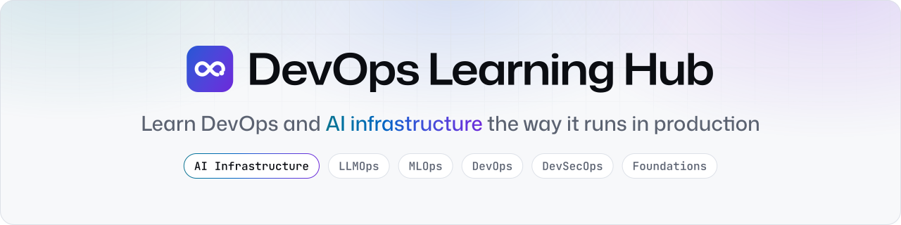

<h1 align="center">
  <picture>
    <source media="(prefers-color-scheme: dark)" srcset="assets/readme/banner-dark.svg" />
    
  </picture>
</h1>

<p align="center">
  Free, open-source guides for DevOps, DevSecOps, MLOps, LLMOps and AI infrastructure on
  Kubernetes. Every page starts from the official docs, adds a hands-on example, and ends with
  production notes and interview scenarios.
</p>

<p align="center">
  <a href="https://github.com/Suraj-kumar00/DevOps/actions/workflows/ci.yml"></a>
  <a href="LICENSE"></a>
  <a href="LICENSE-CONTENT"></a>
  <a href="CONTRIBUTING.md"></a>
</p>

<p align="center">
  <a href="#tracks">Tracks</a> ·
  <a href="#notes-you-can-read-today">Notes</a> ·
  <a href="#how-every-page-is-built">How pages are built</a> ·
  <a href="#run-it-locally">Run it locally</a> ·
  <a href="#contributing">Contributing</a>
</p>

> [!NOTE]
> The site is not live yet. Pages are being written track by track, AI infrastructure first.
> Until a topic has its page, read its [notes on Notion](#notes-you-can-read-today).

<!-- When the site is live: add its URL to the note above, point the track links at the site, and use the URL in the MCP example. -->

## Tracks

AI infrastructure on Kubernetes is the focus. DevOps, DevSecOps and the foundations are what it
stands on, so they are covered too.

| Track                                                | What it covers                                                                                          |
| ---------------------------------------------------- | ------------------------------------------------------------------------------------------------------- |
| [AI Infrastructure](content/docs/ai-infra/index.mdx) | Run GPU and LLM workloads on Kubernetes: scheduling, sharing, serving, autoscaling and observability.   |
| [LLMOps](content/docs/llmops/index.mdx)              | Serving, evaluating, observing and controlling the cost of applications built on large language models. |
| [MLOps](content/docs/mlops/index.mdx)                | Pipelines, experiment tracking, model registries and monitoring for machine learning in production.     |
| [DevOps](content/docs/devops/index.mdx)              | Containers, Kubernetes, CI/CD, infrastructure as code and observability, with the mindset behind them.  |
| [DevSecOps](content/docs/devsecops/index.mdx)        | Security built into delivery, from the software supply chain to running workloads.                      |
| [Foundations](content/docs/foundations/index.mdx)    | Linux, networking, Git, shell scripting and the other basics every later track builds on.               |

Each track page lists its published pages and its roadmap. The roadmap lives in the page's
frontmatter, and a topic leaves it as soon as its page is published.

## Notes you can read today

Until a topic has its page, its notes are on Notion. Select a topic to open them.

<!--
  Logos are in assets/readme/logos. Brand logos are the official marks from Simple Icons 16.33.0
  (CC0-1.0), the same ones the site uses (components/icons/brand-logos.tsx). DevOps, Networking
  and Build tools have no brand logo, and AWS and Microsoft allow their names in plain text only,
  so those five use the site's own line icons. Files ending in -light and -dark are swapped with
  <picture> to follow GitHub's theme.
-->

<table>
  <tr>
    <th colspan="7">Foundations</th>
  </tr>
  <tr>
    <td align="center" valign="top" width="84"><a href="https://surajkumar00.notion.site/Understanding-DevOps-f1f9aad413324e6cb1c78e2caeae5795"><picture><source media="(prefers-color-scheme: dark)" srcset="assets/readme/logos/devops-dark.svg" /></picture><br /><sub>Understanding DevOps</sub></a></td>
    <td align="center" valign="top" width="84"><a href="https://surajkumar00.notion.site/Learning-Linux-52fe48ab9ede4f709e059886c30a70a3"><picture><source media="(prefers-color-scheme: dark)" srcset="assets/readme/logos/linux-dark.svg" /></picture><br /><sub>Linux</sub></a></td>
    <td align="center" valign="top" width="84"><a href="https://surajkumar00.notion.site/Computer-Networking-7ebc4910536249329bbc21563899d621"><picture><source media="(prefers-color-scheme: dark)" srcset="assets/readme/logos/network-dark.svg" /></picture><br /><sub>Networking</sub></a></td>
    <td align="center" valign="top" width="84"><a href="https://surajkumar00.notion.site/Shell-Bash-Scripting-a250e00baeaa4506b43e4429f18c065c"><br /><sub>Shell scripting</sub></a></td>
    <td align="center" valign="top" width="84"><a href="https://surajkumar00.notion.site/Git-and-GitHub-b08edfadba2a4c33860949dfb8d81ae7"><br /><sub>Git and GitHub</sub></a></td>
    <td align="center" valign="top" width="84"><a href="https://surajkumar00.notion.site/YAML-YAML-Ain-t-Markup-Language-356715dae3fa432a8af713cf38e9fbdd"><br /><sub>YAML</sub></a></td>
    <td align="center" valign="top" width="84"><a href="https://surajkumar00.notion.site/Python-for-DevOps-7c6d6cb5f5b54c7098deddc1c4ffc69e"><br /><sub>Python for DevOps</sub></a></td>
  </tr>
</table>

<table>
  <tr>
    <th colspan="7">DevOps and cloud</th>
  </tr>
  <tr>
    <td align="center" valign="top" width="84"><a href="https://surajkumar00.notion.site/Build-and-package-manager-tools-b911aebca40642cca041780a82c4201a"><picture><source media="(prefers-color-scheme: dark)" srcset="assets/readme/logos/package-dark.svg" /></picture><br /><sub>Build tools</sub></a></td>
    <td align="center" valign="top" width="84"><a href="https://surajkumar00.notion.site/Containerization-Docker-0d09fa2b92dd46ac9e938e573bb10e64"><br /><sub>Docker</sub></a></td>
    <td align="center" valign="top" width="84"><a href="https://surajkumar00.notion.site/Container-Orchatration-Kubernetes-c43869b2dda84e1c8c6218de5b5bdc43"><br /><sub>Kubernetes</sub></a></td>
    <td align="center" valign="top" width="84"><a href="https://surajkumar00.notion.site/CI-CD-e999decefb8243a2b613a304bf1fe38b"><br /><sub>CI/CD</sub></a></td>
    <td align="center" valign="top" width="84"><a href="https://surajkumar00.notion.site/Infrastructure-as-code-81a1e5e6f9e442e4bf8799151dec35c2"><br /><sub>Infrastructure as code</sub></a></td>
    <td align="center" valign="top" width="84"><a href="https://surajkumar00.notion.site/Learning-AWS-7399a5eaa9674b44932ee52374110629"><picture><source media="(prefers-color-scheme: dark)" srcset="assets/readme/logos/cloud-dark.svg" /></picture><br /><sub>AWS</sub></a></td>
    <td align="center" valign="top" width="84"><a href="https://surajkumar00.notion.site/Learning-Microsoft-Azure-a5abd9814d134f1f9f6f1a4dba09b501"><picture><source media="(prefers-color-scheme: dark)" srcset="assets/readme/logos/cloud-dark.svg" /></picture><br /><sub>Azure</sub></a></td>
  </tr>
</table>

## How every page is built

1. **What and why**: a plain-language definition based on the official docs, and the problem the
   tool solves.
2. **How it works**: architecture and core concepts, with a diagram drawn for the site.
3. **Hands-on**: a minimal example that was actually run, pinned to the version it was tested with.
4. **Production notes**: failure modes, trade-offs, security, observability and cost.
5. **Interview scenarios**: scenario-based questions with model answers, tagged by level.
6. **Sources and credits**: official docs first, and every community author named.

Topic pages must declare their level, the version they were verified against, the date they were
verified and at least one official source, or the build fails. Pages not verified for 180 days
show a notice that they may be outdated. The full template is in
[page-template.mdx](content/docs/%28start%29/page-template.mdx).

## For AI tools

- `/llms.txt` and `/llms-full.txt`: an index of every page, and the full text.
- Any docs URL with `.md` appended returns Markdown, and so does a request with
  `Accept: text/markdown`.
- `/api/mcp`: a read-only [MCP](https://modelcontextprotocol.io) server with `list_pages`,
  `get_page` and `search` tools.

Until the site is live, run it locally and point your MCP client at it:

```json
{
  "mcpServers": {
    "devops-hub": { "url": "http://localhost:3000/api/mcp" }
  }
}
```

## Tech stack

[Fumadocs](https://fumadocs.dev) 16 on [Next.js](https://nextjs.org) 16 and React 19,
Tailwind CSS 4, TypeScript 7, [oxlint](https://oxc.rs), Prettier and Vitest. Search is built in
(Orama), diagrams use Mermaid, and the fonts are Mona Sans and JetBrains Mono.

## Run it locally

Requires Node.js 24 (see `.nvmrc`; 22.12 or newer works) and npm.

```bash
npm ci
npm run dev      # http://localhost:3000
npm run check    # lint, types, formatting and unit tests
npm run build    # production build, also validates all content
npm run links    # checks internal links, with `npm start` running
```

## Deploy

**Vercel**: import the repository; no configuration needed.

**Docker** (standalone Next.js server, runs as a non-root user):

```bash
docker build --build-arg SITE_URL=https://your.domain -t devops-learning-hub .
docker run -p 3000:3000 -e SITE_URL=https://your.domain devops-learning-hub
```

Environment variables (all optional) are documented in [`.env.example`](.env.example).
The container exposes `/api/health` for liveness and readiness probes.

## Contributing

Contributions are welcome, from a one-line fix to a full page. Start with
[CONTRIBUTING.md](CONTRIBUTING.md), and please follow the [Code of Conduct](CODE_OF_CONDUCT.md).
Report security issues privately as described in [SECURITY.md](SECURITY.md).

If the handbook helps you, a star on the repository helps other people find it.

## Blog and projects

- **Blog**: [Suraj's Odyssey](https://hashnode.com/@surajkumar00) on Hashnode, for longer
  write-ups.
- **Project**: [DevOps URL2QR](https://github.com/Suraj-kumar00/DevOps-URL2QR), a DevOps capstone
  project that generates QR codes for URLs.

## Maintainer

Built and maintained by [Suraj](https://github.com/Suraj-kumar00) ·
[LinkedIn](https://www.linkedin.com/in/surajkumar00) · [X](https://x.com/surajk_umar01)

## License

- Code: [MIT](LICENSE)
- Content in `content/`: [CC BY 4.0](LICENSE-CONTENT)

Logos and trademarks of third-party tools belong to their owners and are used only to identify
those tools.
